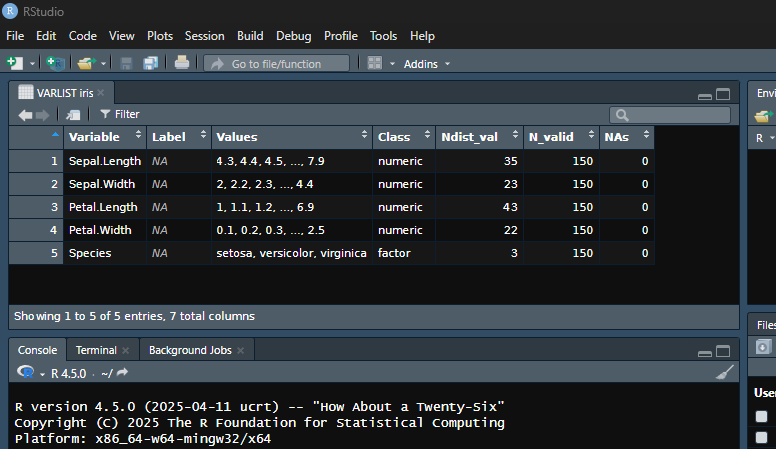
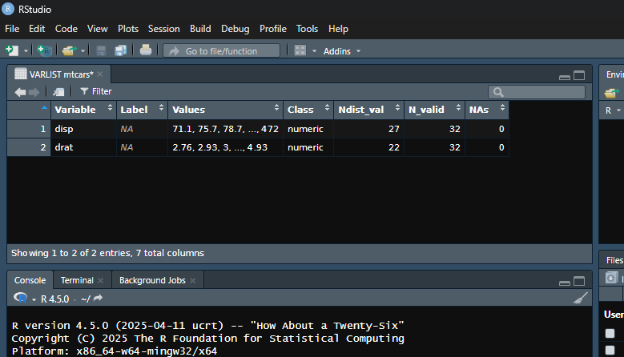

# spicy <a href="https://amaltawfik.github.io/spicy/"></a>

<!-- badges: start -->

[](https://CRAN.R-project.org/package=spicy)
[](https://cranlogs.r-pkg.org/badges/grand-total/spicy)
[](https://github.com/amaltawfik/spicy/releases)
[](https://github.com/amaltawfik/spicy/actions/workflows/R-CMD-check.yaml)
[](https://github.com/amaltawfik/spicy/actions/workflows/rhub.yaml)
[](https://www.repostatus.org/#active)
[](https://opensource.org/licenses/MIT)
[](https://doi.org/10.5281/zenodo.15397865)
<!-- badges: end -->

spicy is designed to make variable exploration, documentation, and
descriptive statistics fast, expressive, and easy to use.

## What is spicy?

spicy is an R package for quick, consistent, and elegant exploration of
data frames. It helps you:

- Extract variable metadata and display compact summaries of dataset
  variables using `varlist()` (with `vl()` as a convenient shortcut),
  including names, labels, values, classes, number of distinct
  non-missing values, number of valid observations, number of missing
  observations. Similar to the “Variable View” in SPSS or the “Variables
  Manager” in Stata.
- Generate an interactive codebook generator `code_book()` that extends
  `varlist()` with searchable summaries and built-in export options
  (Copy, CSV, Excel, PDF, Print) via `DT::datatable`. Ideal for
  documenting all the variables present in a data frame.
- Compute frequency tables with `freq()`, row-wise means with
  `mean_n()`, row-wise sums with `sum_n()`, and counts of specific
  values using `count_n()` — all with automatic handling of missing
  data.
- Explore relationships between categorical variables using
  `cross_tab()` for contingency tables and `cramer_v()` for association
  strength.
- Copy data frames or result tables directly to the clipboard using
  `copy_clipboard()` for fast export to spreadsheets or text editors.
- Extract and assign variable labels from column headers with
  `label_from_names()`, especially useful for LimeSurvey CSV exports
  where headers follow a “name \[separator\] label” pattern — any string
  can be used as the separator (e.g., “.”, ” - “,”:“, etc.).
- Handle `labelled`, `factor`, `Date`, `POSIXct`, and other commonly
  used variable types.

All with intuitive functions that return clean, structured outputs.

------------------------------------------------------------------------

## Installation

For the stable version, install from CRAN.

``` r
install.packages("spicy")
```

You can install the development version of spicy from GitHub with:

``` r
# install.packages("pak")
pak::pak("amaltawfik/spicy")
```

------------------------------------------------------------------------

## Example usage

Here are some quick examples using built-in datasets:

``` r
library(spicy)
library(dplyr)

# Get a summary of all variables in the Viewer
varlist(iris)
```



``` r
# Get a summary of the variables that start with "d" in the Viewer
# Asterisks (*) in the title indicate that the data frame has been subsetted
vl(mtcars, starts_with("d"))
```



``` r
# Get a summary of all variables as a tibble
varlist(iris, tbl = TRUE)
#> # A tibble: 5 × 7
#>   Variable     Label Values                       Class N_distinct N_valid   NAs
#>   <chr>        <chr> <chr>                        <chr>      <int>   <int> <int>
#> 1 Sepal.Length <NA>  4.3, 4.4, 4.5, ..., 7.9      nume…         35     150     0
#> 2 Sepal.Width  <NA>  2, 2.2, 2.3, ..., 4.4        nume…         23     150     0
#> 3 Petal.Length <NA>  1, 1.1, 1.2, ..., 6.9        nume…         43     150     0
#> 4 Petal.Width  <NA>  0.1, 0.2, 0.3, ..., 2.5      nume…         22     150     0
#> 5 Species      <NA>  setosa, versicolor, virgini… fact…          3     150     0

# Tabulate frequencies with sort alphabetically (Z-A)
freq(iris, Species, sort = "name-")
#> Frequency table: Species
#> 
#>  Category │ Values      Freq.  Percent 
#> ──────────┼────────────────────────────
#>  Valid    │ virginica      50     33.3 
#>           │ versicolor     50     33.3 
#>           │ setosa         50     33.3 
#> ──────────┼────────────────────────────
#>  Total    │               150    100.0 
#> 
#> Class: factor
#> Data: iris

# Cross-tab with frequencies
cross_tab(mtcars, cyl, gear)
#> Crosstable: cyl x gear (N)
#> 
#>  Values      │       3        4       5 │      Total 
#> ─────────────┼──────────────────────────┼────────────
#>  4           │       1        8       2 │         11 
#>  6           │       2        4       1 │          7 
#>  8           │      12        0       2 │         14 
#> ─────────────┼──────────────────────────┼────────────
#>  Total       │      15       12       5 │         32 
#> 
#> Chi-2: 18.0 (df = 4), p = 0.001
#> Cramer's V: 0.53
#> Warning: 6 expected cells < 5 (66.7%). Minimum expected = 1.09. Consider `simulate_p = TRUE` or set globally via `options(spicy.simulate_p = TRUE)`.

# Cross-tab with column percentages
cross_tab(mtcars, cyl, gear, percent = "column")
#> Crosstable: cyl x gear (Column %)
#> 
#>  Values      │          3           4           5 │      Total 
#> ─────────────┼────────────────────────────────────┼────────────
#>  4           │        6.7        66.7        40.0 │       34.4 
#>  6           │       13.3        33.3        20.0 │       21.9 
#>  8           │       80.0         0.0        40.0 │       43.8 
#> ─────────────┼────────────────────────────────────┼────────────
#>  Total       │      100.0       100.0       100.0 │      100.0 
#>  N           │         15          12           5 │         32 
#> 
#> Chi-2: 18.0 (df = 4), p = 0.001
#> Cramer's V: 0.53
#> Warning: 6 expected cells < 5 (66.7%). Minimum expected = 1.09. Consider `simulate_p = TRUE` or set globally via `options(spicy.simulate_p = TRUE)`.

# Cross-tab with row percentages
cross_tab(mtcars, cyl, gear, percent = "row")
#> Crosstable: cyl x gear (Row %)
#> 
#>  Values      │         3          4          5 │      Total        N 
#> ─────────────┼─────────────────────────────────┼─────────────────────
#>  4           │       9.1       72.7       18.2 │      100.0       11 
#>  6           │      28.6       57.1       14.3 │      100.0        7 
#>  8           │      85.7        0.0       14.3 │      100.0       14 
#> ─────────────┼─────────────────────────────────┼─────────────────────
#>  Total       │      46.9       37.5       15.6 │      100.0       32 
#> 
#> Chi-2: 18.0 (df = 4), p = 0.001
#> Cramer's V: 0.53
#> Warning: 6 expected cells < 5 (66.7%). Minimum expected = 1.09. Consider `simulate_p = TRUE` or set globally via `options(spicy.simulate_p = TRUE)`.

# Cross-tab with grouped by a single variable
cross_tab(mtcars, cyl, gear, by = am)
#> Crosstable: cyl x gear (N) | am = 0
#> 
#>  Values      │       3       4       5 │      Total 
#> ─────────────┼─────────────────────────┼────────────
#>  4           │       1       2       0 │          3 
#>  6           │       2       2       0 │          4 
#>  8           │      12       0       0 │         12 
#> ─────────────┼─────────────────────────┼────────────
#>  Total       │      15       4       0 │         19 
#> 
#> Chi-2: NA (df = 4), p = NA
#> Cramer's V: NA
#> Warning: 8 expected cells < 5 (88.9%). 5 expected cells < 1. Minimum expected = 0. Consider `simulate_p = TRUE` or set globally via `options(spicy.simulate_p = TRUE)`.
#> 
#> Crosstable: cyl x gear (N) | am = 1
#> 
#>  Values      │      3       4       5 │      Total 
#> ─────────────┼────────────────────────┼────────────
#>  4           │      0       6       2 │          8 
#>  6           │      0       2       1 │          3 
#>  8           │      0       0       2 │          2 
#> ─────────────┼────────────────────────┼────────────
#>  Total       │      0       8       5 │         13 
#> 
#> Chi-2: NA (df = 4), p = NA
#> Cramer's V: NA
#> Warning: 9 expected cells < 5 (100%). 4 expected cells < 1. Minimum expected = 0. Consider `simulate_p = TRUE` or set globally via `options(spicy.simulate_p = TRUE)`.

# Cross-tab with grouped by two variables
cross_tab(mtcars, cyl, gear, by = interaction(vs, am))
#> Crosstable: cyl x gear (N) | vs x am = 0.0
#> 
#>  Values      │       3       4       5 │      Total 
#> ─────────────┼─────────────────────────┼────────────
#>  4           │       0       0       0 │          0 
#>  6           │       0       0       0 │          0 
#>  8           │      12       0       0 │         12 
#> ─────────────┼─────────────────────────┼────────────
#>  Total       │      12       0       0 │         12 
#> 
#> Chi-2 and Cramer's V not computed: insufficient data (only one non-empty row/column).
#> 
#> Crosstable: cyl x gear (N) | vs x am = 1.0
#> 
#>  Values      │      3       4       5 │      Total 
#> ─────────────┼────────────────────────┼────────────
#>  4           │      1       2       0 │          3 
#>  6           │      2       2       0 │          4 
#>  8           │      0       0       0 │          0 
#> ─────────────┼────────────────────────┼────────────
#>  Total       │      3       4       0 │          7 
#> 
#> Chi-2: NA (df = 4), p = NA
#> Cramer's V: NA
#> Warning: 9 expected cells < 5 (100%). 5 expected cells < 1. Minimum expected = 0. Consider `simulate_p = TRUE` or set globally via `options(spicy.simulate_p = TRUE)`.
#> 
#> Crosstable: cyl x gear (N) | vs x am = 0.1
#> 
#>  Values      │      3       4       5 │      Total 
#> ─────────────┼────────────────────────┼────────────
#>  4           │      0       0       1 │          1 
#>  6           │      0       2       1 │          3 
#>  8           │      0       0       2 │          2 
#> ─────────────┼────────────────────────┼────────────
#>  Total       │      0       2       4 │          6 
#> 
#> Chi-2: NA (df = 4), p = NA
#> Cramer's V: NA
#> Warning: 9 expected cells < 5 (100%). 6 expected cells < 1. Minimum expected = 0. Consider `simulate_p = TRUE` or set globally via `options(spicy.simulate_p = TRUE)`.
#> 
#> Crosstable: cyl x gear (N) | vs x am = 1.1
#> 
#>  Values      │      3       4       5 │      Total 
#> ─────────────┼────────────────────────┼────────────
#>  4           │      0       6       1 │          7 
#>  6           │      0       0       0 │          0 
#>  8           │      0       0       0 │          0 
#> ─────────────┼────────────────────────┼────────────
#>  Total       │      0       6       1 │          7 
#> 
#> Chi-2 and Cramer's V not computed: insufficient data (only one non-empty row/column).

# Compute row-wise mean/sum (all values must be valid by default) or specific value
df <- data.frame(
  var1 = c(10, NA, 30, 40, 50),
  var2 = c(5, NA, 15, NA, 25),
  var3 = c(NA, 30, 20, 50, 10)
)
df
#>   var1 var2 var3
#> 1   10    5   NA
#> 2   NA   NA   30
#> 3   30   15   20
#> 4   40   NA   50
#> 5   50   25   10
mean_n(df)
#> [1]       NA       NA 21.66667       NA 28.33333
sum_n(df)
#> [1] NA NA 65 NA 85
count_n(df, count = 10)
#> [1] 1 0 0 0 1
count_n(df, special = "NA")
#> [1] 1 2 0 1 0
df |> mutate(count30 = count_n(count = 30))
#>   var1 var2 var3 count30
#> 1   10    5   NA       0
#> 2   NA   NA   30       1
#> 3   30   15   20       1
#> 4   40   NA   50       0
#> 5   50   25   10       0

# Extract labels from column names like "varname. label"
# This format ("name. label") is the default in LimeSurvey CSV exports
# when using: Export results → Export format: CSV → Headings: Question code & question text.
# It uses ". " (dot + space) as the default separator between the question code and question text.
df <- tibble::tibble(
  "age. Age of respondent" = c(25, 30),
  "score. Total score. Manually computed." = c(12, 14)
)

out <- label_from_names(df)

# View assigned labels
labelled::var_label(out)
#> $age
#> [1] "Age of respondent"
#> 
#> $score
#> [1] "Total score. Manually computed."
```

> All functions can be directly used in pipelines.

------------------------------------------------------------------------

## Why use `spicy`?

- Clean, expressive output  
- Works well with labelled survey data  
- Handles weights, percentages, NA counts  
- Great for exploring data and variables, teaching, or reporting

------------------------------------------------------------------------

## Citation

If you use `spicy` in a publication or teaching material, please cite it
as:

> Tawfik, A. (2025). *spicy: Tools for Data Management and Variable
> Exploration* (Version 0.1.0) \[R package\].
> <https://doi.org/10.5281/zenodo.15397865>

You can also get the citation in R format by typing:

``` r
citation("spicy")
```

Or [download the BibTeX citation](inst/citation.bib) directly.

------------------------------------------------------------------------

## License

This package is licensed under the MIT license. See [`LICENSE`](LICENSE)
for details.
